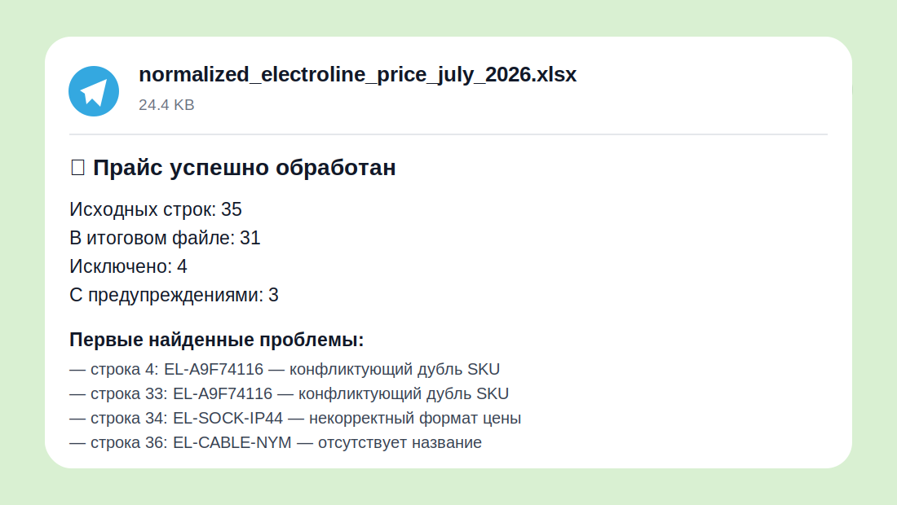
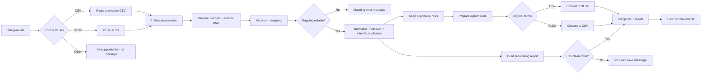

# AI-аудитор прайс-листов поставщиков на n8n

[](https://n8n.io/)
[](https://ollama.com/)
[](LICENSE)

Портфельный pet-project: локальная AI-автоматизация для первичной обработки прайс-листов поставщиков в небольших оптовых B2B-компаниях.

Менеджер отправляет в Telegram файл CSV или XLSX. Workflow определяет назначение незнакомых столбцов с помощью локальной LLM, нормализует товары, валидирует обязательные поля, выявляет точные и конфликтующие дубли, формирует отчёт и возвращает очищенный файл **в противоположном формате**:

- CSV → XLSX
- XLSX → CSV

> Это учебный демонстрационный кейс на синтетических данных, а не внедрение у реального клиента.

## Бизнес-проблема

Поставщики присылают прайс-листы с разными названиями и порядком столбцов. Сотрудник вручную ищет SKU, название, цену, остаток, единицу измерения и производителя, затем исправляет форматы чисел, удаляет дубли и готовит таблицу к загрузке.

Workflow сокращает ручную первичную проверку до просмотра исключений и готового нормализованного файла.

## Демонстрационный результат

На синтетическом тестовом прайсе:

- исходных строк: **35**
- включено в итоговый файл: **31**
- исключено: **4**
- строк с предупреждениями: **3**



## Что делает система

1. Принимает документ через Telegram.
2. Маршрутизирует CSV и XLSX; другие форматы отклоняет.
3. Загружает и извлекает строки.
4. Передаёт заголовки и пять примеров строк в Information Extractor.
5. Локальная Qwen 2.5 7B сопоставляет исходные столбцы со стандартными ролями.
6. Проверяет обязательные соответствия и порог уверенности.
7. Нормализует SKU, текст, цены и остатки.
8. Разделяет ошибки и предупреждения.
9. Находит точные и конфликтующие дубли SKU.
10. Экспортирует только валидные уникальные строки.
11. Формирует краткий отчёт и возвращает файл в Telegram.

## Архитектура



## Контракт данных

Итоговая товарная строка:

```json
{
  "sku": "EL-A9F74106",
  "name": "Автоматический выключатель 1P C6 6kA",
  "price": 412.5,
  "stock": 95,
  "unit": "шт",
  "manufacturer": "Systeme Electric",
  "currency": "RUB"
}
```

Технические поля до экспорта включают:

- `sku_key`
- `source_row_number`
- `price_status`
- `stock_status`
- `duplicate_status`
- `errors`
- `warnings`
- `is_valid`
- `is_exportable`
- `mapping_confidence`

## Бизнес-правила MVP

Строка не экспортируется, если:

- отсутствует SKU;
- отсутствует название;
- цена пустая, не распарсилась или меньше/равна нулю;
- остаток отрицательный;
- один SKU встречается с разными данными.

Предупреждение не блокирует экспорт, если:

- единица измерения отсутствует;
- валюта не определена;
- остаток указан как `9800+`;
- остаток указан текстом `ожидается`;
- строка является первой записью группы точных дублей.

## Стек

- n8n
- Telegram Bot API
- community node `n8n-nodes-telegram-polling`
- Ollama
- Qwen 2.5 7B
- Information Extractor + JSON Schema
- Code node
- CSV/XLSX parsing and file conversion

LLM запускается локально, поэтому демонстрация не требует оплаты внешнего AI API.

## Установка

### 1. Требования

- работающий n8n;
- Ollama, доступная из n8n;
- модель:

```bash
ollama pull qwen2.5:7b
```

- Telegram-бот;
- установленная community node:

```text
n8n-nodes-telegram-polling
```

### 2. Импорт

1. Установите community node в n8n.
2. Если `workflow/ai-price-list-auditor.json` отсутствует, выполните `python workflow/restore-workflow.py`.
3. Импортируйте `workflow/ai-price-list-auditor.json`.
4. Создайте Telegram credential.
5. Создайте Ollama credential.
6. Назначьте credentials соответствующим нодам.
7. Проверьте URL Ollama из контейнера n8n.
8. Активируйте workflow.
9. Отправьте тестовый CSV с разделителем `;` или XLSX.

Экспорт workflow очищен от credentials, webhook ID, instance metadata и pinned data.

## Тестовые данные

- `samples/input/sample-price-semicolon.csv`
- `samples/expected-output/normalized-sample-price.csv`

Подробные сценарии: [docs/test-cases.md](docs/test-cases.md).

## Известные ограничения

- CSV поддерживается только с разделителем `;`.
- Заголовки должны находиться в первой строке.
- Для XLSX предполагается одна рабочая таблица стандартной структуры.
- Автоопределение кодировки и разделителя не реализовано.
- История обработок и база товаров не сохраняются.
- Отдельный Error Trigger workflow для инфраструктурных сбоев не включён.
- Качество маппинга зависит от заголовков, примеров строк и локальной модели.
- Подпись Telegram показывает первые пять проблемных строк.

## Безопасность

- Не публикуйте токен Telegram и реальные прайсы клиентов.
- Не закрепляйте production-данные перед экспортом workflow.
- Храните credentials только в n8n.
- Проверяйте экспортированный JSON перед публикацией.

Подробнее: [SECURITY.md](SECURITY.md).

## Структура репозитория

```text
.
├── README.md
├── LICENSE
├── SECURITY.md
├── CHANGELOG.md
├── workflow/
│   ├── ai-price-list-auditor.json
│   ├── ai-price-list-auditor.json.gz.b64
│   └── restore-workflow.py
├── samples/
│   ├── input/
│   │   └── sample-price-semicolon.csv
│   └── expected-output/
│       └── normalized-sample-price.csv
└── docs/
    ├── data-contract.md
    ├── test-cases.md
    └── telegram-result.svg
```

## Возможное развитие

- автоопределение разделителя CSV;
- файл отклонённых строк;
- несколько листов XLSX;
- PostgreSQL и история импортов;
- сравнение с предыдущим прайсом;
- ручное подтверждение больших изменений;
- отдельный error workflow;
- метрики времени и качества на реальных процессах.

## Автор

Иван — начинающий разработчик AI-автоматизаций на n8n.

Стоимость коммерческой адаптации определяется после разбора процесса и объёма интеграций.
